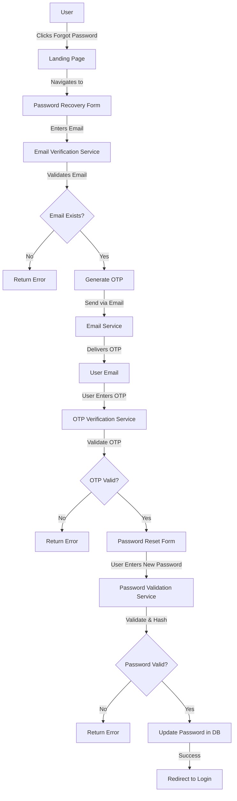
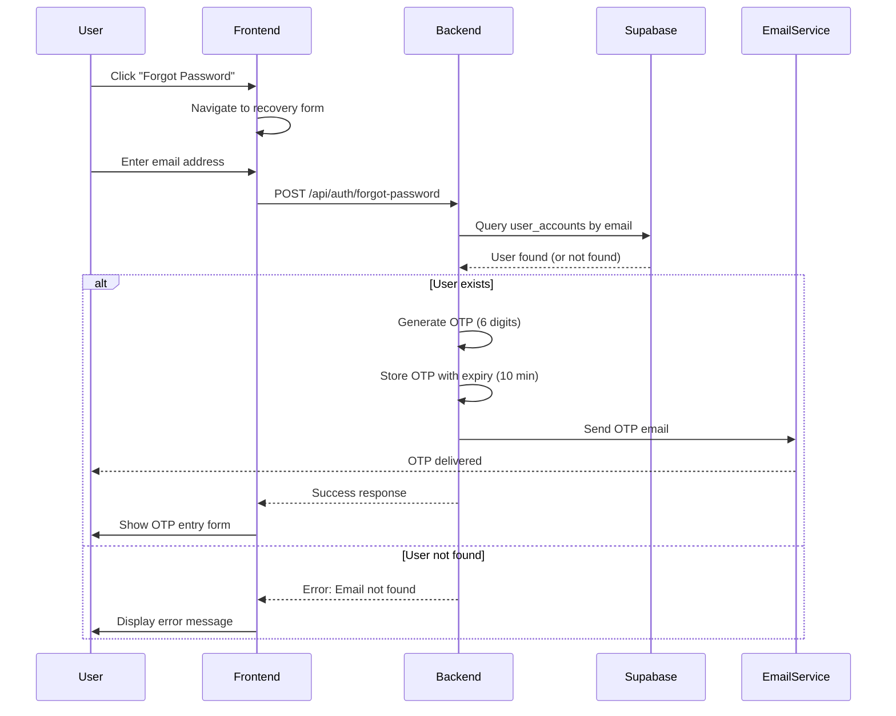
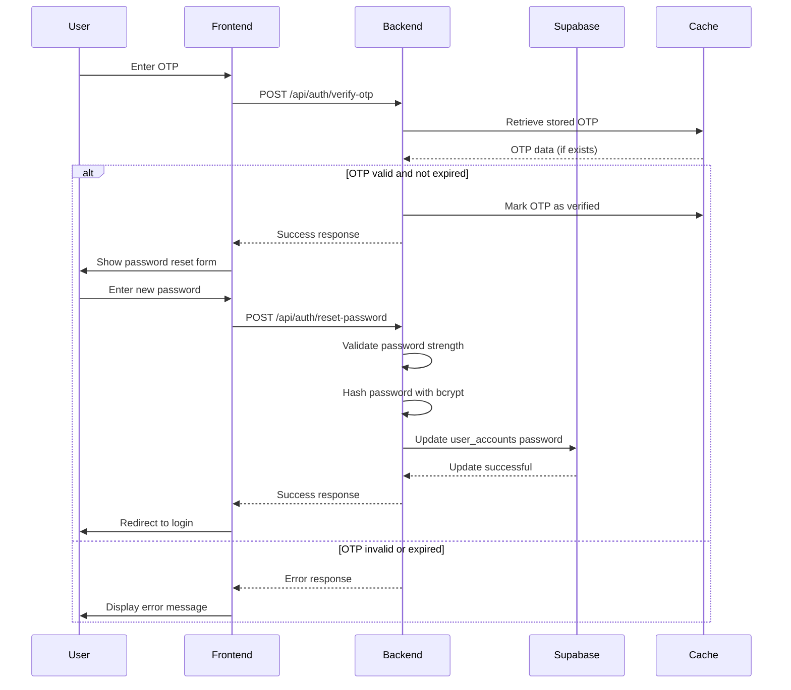

# Design Document: Password Recovery Feature

## Overview

The Password Recovery feature enables users to securely regain access to their accounts through an OTP-based verification process. When users forget their password, they can initiate a recovery flow by providing their registered email address. The system generates and sends a One-Time Password (OTP) to their email, which they must verify before being allowed to set a new password. This design ensures account security while maintaining a smooth user experience.

The feature integrates with the existing Supabase authentication infrastructure and leverages the current email delivery system (Nodemailer) to send OTP codes. The implementation follows the existing authentication patterns in the codebase while introducing new password reset capabilities.

## Architecture



## Sequence Diagrams

### Password Recovery Initiation Flow



### OTP Verification and Password Reset Flow



## Components and Interfaces

### Component 1: Password Recovery Controller

**Purpose**: Handles all password recovery endpoints and orchestrates the recovery workflow

**Interface**:
```pascal
INTERFACE PasswordRecoveryController
  METHOD initiateRecovery(email: String): RecoveryResponse
  METHOD verifyOTP(email: String, otp: String): VerificationResponse
  METHOD resetPassword(email: String, newPassword: String): ResetResponse
  METHOD validatePasswordStrength(password: String): ValidationResult
END INTERFACE
```

**Responsibilities**:
- Validate user email existence
- Generate and manage OTP lifecycle
- Coordinate email delivery
- Validate OTP codes
- Process password reset requests
- Enforce security constraints

### Component 2: OTP Service

**Purpose**: Manages OTP generation, storage, and validation

**Interface**:
```pascal
INTERFACE OTPService
  METHOD generateOTP(): String
  METHOD storeOTP(email: String, otp: String, expiryMinutes: Integer): Boolean
  METHOD verifyOTP(email: String, otp: String): Boolean
  METHOD invalidateOTP(email: String): Boolean
  METHOD isOTPExpired(email: String): Boolean
END INTERFACE
```

**Responsibilities**:
- Generate cryptographically secure OTP codes
- Store OTP with expiration timestamps
- Validate OTP against stored values
- Manage OTP lifecycle and cleanup
- Track OTP attempts for security

### Component 3: Email Service

**Purpose**: Handles OTP email delivery

**Interface**:
```pascal
INTERFACE EmailService
  METHOD sendOTPEmail(email: String, otp: String, userName: String): Boolean
  METHOD sendPasswordResetConfirmation(email: String, userName: String): Boolean
END INTERFACE
```

**Responsibilities**:
- Format OTP email templates
- Send emails via Nodemailer
- Handle delivery failures
- Log email transactions

### Component 4: Password Validator

**Purpose**: Validates password strength and compliance

**Interface**:
```pascal
INTERFACE PasswordValidator
  METHOD validateStrength(password: String): ValidationResult
  METHOD validateMatch(password: String, confirmPassword: String): Boolean
  METHOD hashPassword(password: String): String
END INTERFACE
```

**Responsibilities**:
- Enforce password length requirements (minimum 8 characters)
- Check for complexity requirements
- Verify password confirmation match
- Hash passwords using bcrypt
- Prevent common weak passwords

### Component 5: Frontend UI Components

**Purpose**: Render password recovery forms and manage user interactions

**Components**:
- `ForgotPasswordForm`: Email entry form
- `OTPVerificationForm`: OTP code entry form
- `PasswordResetForm`: New password entry form
- `RecoveryStatusIndicator`: Progress indicator showing recovery stage

## Data Models

### Model 1: PasswordRecoverySession

```pascal
STRUCTURE PasswordRecoverySession
  email: String (primary identifier)
  otp: String (6-digit code)
  otpCreatedAt: Timestamp
  otpExpiresAt: Timestamp
  otpAttempts: Integer (default: 0)
  maxAttempts: Integer (default: 5)
  isVerified: Boolean (default: false)
  recoveryToken: String (unique token for session)
  createdAt: Timestamp
  updatedAt: Timestamp
END STRUCTURE
```

**Validation Rules**:
- `email` must be non-empty and valid email format
- `otp` must be exactly 6 digits
- `otpExpiresAt` must be after `otpCreatedAt`
- `otpAttempts` must not exceed `maxAttempts`
- `recoveryToken` must be unique and cryptographically secure

### Model 2: PasswordResetRequest

```pascal
STRUCTURE PasswordResetRequest
  email: String
  newPassword: String
  confirmPassword: String
  recoveryToken: String
  timestamp: Timestamp
END STRUCTURE
```

**Validation Rules**:
- `email` must match the email in the recovery session
- `newPassword` must meet strength requirements
- `newPassword` must equal `confirmPassword`
- `recoveryToken` must be valid and not expired
- Password must not be the same as previous password

### Model 3: PasswordRecoveryAuditLog

```pascal
STRUCTURE PasswordRecoveryAuditLog
  id: UUID
  email: String
  action: String (INITIATED, OTP_SENT, OTP_VERIFIED, PASSWORD_RESET, FAILED_ATTEMPT)
  status: String (SUCCESS, FAILURE)
  failureReason: String (optional)
  ipAddress: String
  userAgent: String
  timestamp: Timestamp
END STRUCTURE
```

**Validation Rules**:
- `action` must be one of the predefined values
- `status` must be SUCCESS or FAILURE
- `timestamp` must be current time
- `ipAddress` must be valid IP format

## Algorithmic Pseudocode

### Main Password Recovery Algorithm

```pascal
ALGORITHM initiatePasswordRecovery(email)
INPUT: email of type String
OUTPUT: response of type RecoveryResponse

BEGIN
  ASSERT email IS NOT NULL AND email IS NOT EMPTY
  
  // Step 1: Normalize and validate email
  normalizedEmail ← normalizeEmail(email)
  
  IF NOT isValidEmailFormat(normalizedEmail) THEN
    RETURN RecoveryResponse(success: false, message: "Invalid email format")
  END IF
  
  // Step 2: Check if user exists in database
  user ← database.queryUserByEmail(normalizedEmail)
  
  IF user IS NULL THEN
    // Security: Don't reveal if email exists
    RETURN RecoveryResponse(success: true, message: "If email exists, OTP will be sent")
  END IF
  
  // Step 3: Check for existing active recovery session
  existingSession ← cache.getRecoverySession(normalizedEmail)
  
  IF existingSession IS NOT NULL AND NOT isExpired(existingSession) THEN
    IF existingSession.otpAttempts >= existingSession.maxAttempts THEN
      RETURN RecoveryResponse(success: false, message: "Too many attempts. Try again later.")
    END IF
  END IF
  
  // Step 4: Generate OTP
  otp ← generateSecureOTP(length: 6)
  ASSERT otp IS NOT NULL AND length(otp) = 6
  
  // Step 5: Create recovery session
  session ← PasswordRecoverySession(
    email: normalizedEmail,
    otp: otp,
    otpCreatedAt: currentTime(),
    otpExpiresAt: currentTime() + 10 minutes,
    otpAttempts: 0,
    maxAttempts: 5,
    isVerified: false,
    recoveryToken: generateSecureToken()
  )
  
  // Step 6: Store session in cache
  cache.storeRecoverySession(normalizedEmail, session)
  
  // Step 7: Send OTP email
  emailSent ← emailService.sendOTPEmail(
    email: normalizedEmail,
    otp: otp,
    userName: user.first_name
  )
  
  IF NOT emailSent THEN
    cache.invalidateRecoverySession(normalizedEmail)
    RETURN RecoveryResponse(success: false, message: "Failed to send OTP. Please try again.")
  END IF
  
  // Step 8: Log audit trail
  auditLog.record(
    email: normalizedEmail,
    action: "INITIATED",
    status: "SUCCESS",
    ipAddress: getClientIP(),
    userAgent: getUserAgent()
  )
  
  RETURN RecoveryResponse(
    success: true,
    message: "OTP sent to your email",
    recoveryToken: session.recoveryToken
  )
END
```

**Preconditions**:
- `email` parameter is provided and non-null
- Email service is available and configured
- Cache system is operational
- Database connection is active

**Postconditions**:
- If successful: OTP is generated, stored, and email is sent
- If successful: Recovery session is created with 10-minute expiry
- If successful: Audit log entry is recorded
- If failed: No recovery session is created
- Response indicates success or failure with appropriate message

**Loop Invariants**: N/A (no loops in main algorithm)

### OTP Verification Algorithm

```pascal
ALGORITHM verifyOTP(email, otp, recoveryToken)
INPUT: email of type String, otp of type String, recoveryToken of type String
OUTPUT: response of type VerificationResponse

BEGIN
  ASSERT email IS NOT NULL AND otp IS NOT NULL AND recoveryToken IS NOT NULL
  
  // Step 1: Normalize email
  normalizedEmail ← normalizeEmail(email)
  
  // Step 2: Retrieve recovery session from cache
  session ← cache.getRecoverySession(normalizedEmail)
  
  IF session IS NULL THEN
    auditLog.record(email: normalizedEmail, action: "OTP_VERIFIED", status: "FAILURE", failureReason: "No active session")
    RETURN VerificationResponse(success: false, message: "Recovery session not found or expired")
  END IF
  
  // Step 3: Validate recovery token
  IF session.recoveryToken ≠ recoveryToken THEN
    auditLog.record(email: normalizedEmail, action: "OTP_VERIFIED", status: "FAILURE", failureReason: "Invalid token")
    RETURN VerificationResponse(success: false, message: "Invalid recovery token")
  END IF
  
  // Step 4: Check if OTP is expired
  IF currentTime() > session.otpExpiresAt THEN
    cache.invalidateRecoverySession(normalizedEmail)
    auditLog.record(email: normalizedEmail, action: "OTP_VERIFIED", status: "FAILURE", failureReason: "OTP expired")
    RETURN VerificationResponse(success: false, message: "OTP has expired. Please request a new one.")
  END IF
  
  // Step 5: Check attempt limit
  IF session.otpAttempts >= session.maxAttempts THEN
    cache.invalidateRecoverySession(normalizedEmail)
    auditLog.record(email: normalizedEmail, action: "OTP_VERIFIED", status: "FAILURE", failureReason: "Max attempts exceeded")
    RETURN VerificationResponse(success: false, message: "Too many failed attempts. Please request a new OTP.")
  END IF
  
  // Step 6: Verify OTP code
  IF session.otp ≠ otp THEN
    session.otpAttempts ← session.otpAttempts + 1
    cache.updateRecoverySession(normalizedEmail, session)
    auditLog.record(email: normalizedEmail, action: "OTP_VERIFIED", status: "FAILURE", failureReason: "Invalid OTP")
    RETURN VerificationResponse(
      success: false,
      message: "Invalid OTP code",
      attemptsRemaining: session.maxAttempts - session.otpAttempts
    )
  END IF
  
  // Step 7: Mark session as verified
  session.isVerified ← true
  cache.updateRecoverySession(normalizedEmail, session)
  
  // Step 8: Log successful verification
  auditLog.record(email: normalizedEmail, action: "OTP_VERIFIED", status: "SUCCESS")
  
  RETURN VerificationResponse(
    success: true,
    message: "OTP verified successfully",
    recoveryToken: recoveryToken
  )
END
```

**Preconditions**:
- `email`, `otp`, and `recoveryToken` are provided
- Recovery session exists in cache
- OTP has not expired

**Postconditions**:
- If successful: Session is marked as verified
- If successful: User can proceed to password reset
- If failed: Attempt counter is incremented
- If failed: Session may be invalidated if max attempts exceeded
- Audit log entry is recorded for all attempts

**Loop Invariants**: N/A (no loops in main algorithm)

### Password Reset Algorithm

```pascal
ALGORITHM resetPassword(email, newPassword, confirmPassword, recoveryToken)
INPUT: email, newPassword, confirmPassword, recoveryToken of type String
OUTPUT: response of type ResetResponse

BEGIN
  ASSERT email IS NOT NULL AND newPassword IS NOT NULL AND recoveryToken IS NOT NULL
  
  // Step 1: Normalize email
  normalizedEmail ← normalizeEmail(email)
  
  // Step 2: Retrieve recovery session
  session ← cache.getRecoverySession(normalizedEmail)
  
  IF session IS NULL OR NOT session.isVerified THEN
    RETURN ResetResponse(success: false, message: "Recovery session not verified")
  END IF
  
  // Step 3: Validate recovery token
  IF session.recoveryToken ≠ recoveryToken THEN
    RETURN ResetResponse(success: false, message: "Invalid recovery token")
  END IF
  
  // Step 4: Validate password match
  IF newPassword ≠ confirmPassword THEN
    auditLog.record(email: normalizedEmail, action: "PASSWORD_RESET", status: "FAILURE", failureReason: "Passwords do not match")
    RETURN ResetResponse(success: false, message: "Passwords do not match")
  END IF
  
  // Step 5: Validate password strength
  validationResult ← validatePasswordStrength(newPassword)
  
  IF NOT validationResult.isValid THEN
    auditLog.record(email: normalizedEmail, action: "PASSWORD_RESET", status: "FAILURE", failureReason: validationResult.reason)
    RETURN ResetResponse(success: false, message: validationResult.reason)
  END IF
  
  // Step 6: Retrieve user from database
  user ← database.queryUserByEmail(normalizedEmail)
  
  IF user IS NULL THEN
    RETURN ResetResponse(success: false, message: "User not found")
  END IF
  
  // Step 7: Check if new password is same as old password
  IF bcryptCompare(newPassword, user.password) THEN
    auditLog.record(email: normalizedEmail, action: "PASSWORD_RESET", status: "FAILURE", failureReason: "New password same as old")
    RETURN ResetResponse(success: false, message: "New password must be different from current password")
  END IF
  
  // Step 8: Hash new password
  hashedPassword ← bcryptHash(newPassword, saltRounds: 10)
  ASSERT hashedPassword IS NOT NULL
  
  // Step 9: Update password in database
  updateResult ← database.updateUserPassword(
    systemId: user.system_id,
    newPassword: hashedPassword,
    updatedAt: currentTime()
  )
  
  IF NOT updateResult.success THEN
    auditLog.record(email: normalizedEmail, action: "PASSWORD_RESET", status: "FAILURE", failureReason: "Database update failed")
    RETURN ResetResponse(success: false, message: "Failed to update password. Please try again.")
  END IF
  
  // Step 10: Invalidate recovery session
  cache.invalidateRecoverySession(normalizedEmail)
  
  // Step 11: Send confirmation email
  emailService.sendPasswordResetConfirmation(
    email: normalizedEmail,
    userName: user.first_name
  )
  
  // Step 12: Log successful password reset
  auditLog.record(email: normalizedEmail, action: "PASSWORD_RESET", status: "SUCCESS")
  
  RETURN ResetResponse(
    success: true,
    message: "Password reset successfully. Please login with your new password."
  )
END
```

**Preconditions**:
- Recovery session exists and is verified
- User exists in database
- Passwords are provided and non-null

**Postconditions**:
- If successful: Password is updated in database
- If successful: Recovery session is invalidated
- If successful: Confirmation email is sent
- If failed: Password remains unchanged
- Audit log entry is recorded

**Loop Invariants**: N/A (no loops in main algorithm)

## Key Functions with Formal Specifications

### Function 1: generateSecureOTP()

```pascal
FUNCTION generateSecureOTP(length: Integer = 6): String
```

**Preconditions**:
- `length` is a positive integer (typically 6)
- Cryptographic random number generator is available

**Postconditions**:
- Returns a string of exactly `length` digits
- All digits are random and uniformly distributed
- No two consecutive calls return the same value
- Result contains only numeric characters (0-9)

**Loop Invariants**: N/A

### Function 2: validatePasswordStrength()

```pascal
FUNCTION validatePasswordStrength(password: String): ValidationResult
```

**Preconditions**:
- `password` is a non-null string

**Postconditions**:
- Returns ValidationResult with `isValid` boolean
- If invalid: `reason` field contains explanation
- Checks: minimum length (8), complexity, no common patterns
- Does not modify input password

**Loop Invariants**: N/A

### Function 3: normalizeEmail()

```pascal
FUNCTION normalizeEmail(email: String): String
```

**Preconditions**:
- `email` is a non-null string

**Postconditions**:
- Returns email in lowercase
- Whitespace is trimmed from start and end
- Email format is preserved
- Result is suitable for database queries

**Loop Invariants**: N/A

### Function 4: isOTPExpired()

```pascal
FUNCTION isOTPExpired(session: PasswordRecoverySession): Boolean
```

**Preconditions**:
- `session` is a valid PasswordRecoverySession object
- `session.otpExpiresAt` is a valid timestamp

**Postconditions**:
- Returns true if current time > expiry time
- Returns false if current time <= expiry time
- Does not modify session

**Loop Invariants**: N/A

## Example Usage

```pascal
// Example 1: User initiates password recovery
SEQUENCE
  email ← "student@umak.edu.ph"
  response ← initiatePasswordRecovery(email)
  
  IF response.success THEN
    DISPLAY "OTP sent to your email"
    recoveryToken ← response.recoveryToken
  ELSE
    DISPLAY response.message
  END IF
END SEQUENCE

// Example 2: User verifies OTP
SEQUENCE
  otp ← USER_INPUT("Enter 6-digit OTP")
  response ← verifyOTP(email, otp, recoveryToken)
  
  IF response.success THEN
    DISPLAY "OTP verified. Enter new password."
  ELSE
    DISPLAY response.message
    IF response.attemptsRemaining IS NOT NULL THEN
      DISPLAY "Attempts remaining: " + response.attemptsRemaining
    END IF
  END IF
END SEQUENCE

// Example 3: User resets password
SEQUENCE
  newPassword ← USER_INPUT("Enter new password")
  confirmPassword ← USER_INPUT("Confirm password")
  
  response ← resetPassword(email, newPassword, confirmPassword, recoveryToken)
  
  IF response.success THEN
    DISPLAY "Password reset successfully"
    REDIRECT_TO("/login")
  ELSE
    DISPLAY response.message
  END IF
END SEQUENCE
```

## Correctness Properties

### Property 1: OTP Uniqueness
For any two distinct password recovery sessions initiated at different times, the generated OTPs must be different.

```
∀ session1, session2 ∈ PasswordRecoverySessions:
  (session1.email ≠ session2.email ∨ session1.createdAt ≠ session2.createdAt)
  ⟹ session1.otp ≠ session2.otp
```

### Property 2: OTP Expiration Enforcement
An OTP cannot be verified after its expiration time has passed.

```
∀ session ∈ PasswordRecoverySessions:
  (currentTime() > session.otpExpiresAt)
  ⟹ verifyOTP(session.email, session.otp, session.recoveryToken) = false
```

### Property 3: Attempt Limit Enforcement
After maximum attempts are exceeded, no further OTP verification attempts are allowed for that session.

```
∀ session ∈ PasswordRecoverySessions:
  (session.otpAttempts ≥ session.maxAttempts)
  ⟹ verifyOTP(session.email, otp, session.recoveryToken) = false
```

### Property 4: Password Update Atomicity
Either the password is fully updated in the database or it remains unchanged; no partial updates occur.

```
∀ user ∈ Users:
  resetPassword(user.email, newPassword, newPassword, token) = success
  ⟹ (user.password = hash(newPassword) ∧ user.updatedAt = currentTime())
```

### Property 5: Session Invalidation
After successful password reset, the recovery session must be invalidated and cannot be reused.

```
∀ session ∈ PasswordRecoverySessions:
  resetPassword(session.email, pwd, pwd, session.recoveryToken) = success
  ⟹ cache.getRecoverySession(session.email) = null
```

### Property 6: Email Verification Requirement
A password can only be reset after OTP verification is successful.

```
∀ session ∈ PasswordRecoverySessions:
  (session.isVerified = false)
  ⟹ resetPassword(session.email, pwd, pwd, token) = false
```

## Error Handling

### Error Scenario 1: Email Not Found

**Condition**: User enters an email address that is not registered in the system

**Response**: Return generic success message (security best practice - don't reveal if email exists)

**Recovery**: User can try another email or contact support

### Error Scenario 2: OTP Expired

**Condition**: User attempts to verify OTP after 10-minute expiration window

**Response**: Return error message "OTP has expired. Please request a new one."

**Recovery**: User initiates new password recovery flow

### Error Scenario 3: Invalid OTP

**Condition**: User enters incorrect OTP code

**Response**: Return error with remaining attempts count

**Recovery**: User can retry with correct OTP or request new one after max attempts

### Error Scenario 4: Max Attempts Exceeded

**Condition**: User exceeds maximum OTP verification attempts (5 attempts)

**Response**: Invalidate session and return error message

**Recovery**: User must initiate new password recovery flow

### Error Scenario 5: Password Mismatch

**Condition**: New password and confirmation password do not match

**Response**: Return error "Passwords do not match"

**Recovery**: User re-enters passwords

### Error Scenario 6: Weak Password

**Condition**: New password does not meet strength requirements

**Response**: Return error with specific requirements not met

**Recovery**: User enters stronger password

### Error Scenario 7: Email Service Failure

**Condition**: Email service is unavailable or fails to send OTP

**Response**: Return error "Failed to send OTP. Please try again."

**Recovery**: User retries after service recovery

### Error Scenario 8: Database Connection Failure

**Condition**: Database is unavailable during password update

**Response**: Return error "Failed to update password. Please try again."

**Recovery**: User retries after database recovery

## Testing Strategy

### Unit Testing Approach

**Test Coverage Areas**:
- OTP generation produces valid 6-digit codes
- OTP expiration logic correctly identifies expired codes
- Password strength validation enforces all requirements
- Email normalization handles various formats
- Attempt counter increments correctly
- Session creation and retrieval from cache
- Password hashing produces consistent results

**Key Test Cases**:
1. Generate OTP and verify format (6 digits, numeric only)
2. Verify OTP expires after 10 minutes
3. Verify password requires minimum 8 characters
4. Verify password requires at least one uppercase letter
5. Verify password requires at least one number
6. Verify password requires at least one special character
7. Verify attempt counter resets on new session
8. Verify max attempts (5) blocks further verification
9. Verify email normalization (lowercase, trim whitespace)
10. Verify password confirmation match validation

### Property-Based Testing Approach

**Property-Based Test Library**: fast-check (JavaScript)

**Properties to Test**:
1. **OTP Uniqueness**: For any two different sessions, generated OTPs are different
2. **Expiration Enforcement**: OTPs cannot be verified after expiration
3. **Attempt Limit**: After max attempts, verification always fails
4. **Password Hashing**: Same password always produces different hashes (due to salt)
5. **Email Normalization**: Normalization is idempotent (normalizing twice = normalizing once)
6. **Session Isolation**: Sessions for different emails don't interfere with each other

**Example Property Test**:
```
Property: OTP verification fails after max attempts
For any valid OTP and session:
  - First 5 incorrect attempts should increment counter
  - 6th attempt should fail and invalidate session
  - Subsequent attempts should fail immediately
```

### Integration Testing Approach

**Test Scenarios**:
1. Complete password recovery flow (email → OTP → reset)
2. Recovery with email service failure
3. Recovery with database failure
4. Concurrent recovery attempts for same email
5. Recovery attempt with invalid recovery token
6. Password reset with unverified session
7. Audit logging for all recovery stages

## Performance Considerations

**OTP Generation**: Cryptographic random generation should complete in <10ms

**Email Delivery**: OTP email should be sent within 2 seconds of request

**Database Queries**: User lookup by email should use indexed queries (<50ms)

**Cache Operations**: OTP storage and retrieval should be <5ms

**Password Hashing**: Bcrypt with 10 salt rounds should complete in <500ms

**Scalability**: System should handle 1000 concurrent recovery requests without degradation

## Security Considerations

**OTP Security**:
- OTPs are 6-digit numeric codes (1 million combinations)
- OTPs expire after 10 minutes
- Maximum 5 verification attempts per session
- OTPs are not logged or displayed in plain text

**Password Security**:
- Passwords are hashed using bcrypt with 10 salt rounds
- Passwords must meet minimum strength requirements
- Old passwords are not reused
- Password reset invalidates all active sessions

**Session Security**:
- Recovery sessions use cryptographically secure tokens
- Sessions are stored in cache with expiration
- Sessions are invalidated after successful reset
- Sessions are invalidated after max attempts exceeded

**Email Security**:
- Email addresses are normalized and validated
- System doesn't reveal if email exists (generic success message)
- OTP emails are sent from verified sender address
- Email delivery is logged for audit purposes

**Audit Trail**:
- All recovery actions are logged with timestamp, IP, and user agent
- Logs include success/failure status and failure reasons
- Logs are retained for security analysis and compliance

**Rate Limiting**:
- Maximum 3 recovery initiations per email per hour
- Maximum 5 OTP verification attempts per session
- Implement IP-based rate limiting to prevent brute force attacks

## Dependencies

**External Libraries**:
- `bcrypt` (^6.0.0): Password hashing
- `nodemailer` (^8.0.5): Email delivery
- `@supabase/supabase-js` (^2.49.1): Database operations

**Internal Dependencies**:
- `config/supabase.js`: Database connection
- `controllers/authController.js`: Existing auth patterns
- `lib/dbUtils.js`: Database utility functions
- `templates/LANDING_PAGE.HTML`: Frontend UI

**Infrastructure**:
- Supabase database with user_accounts table
- Email service (SMTP) configured via Nodemailer
- Cache system (Redis or in-memory) for OTP storage
- Audit logging system

